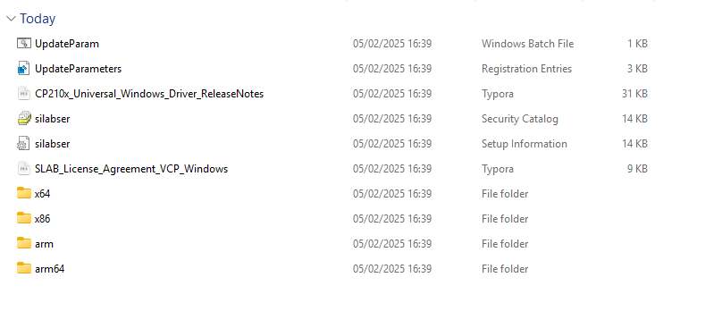
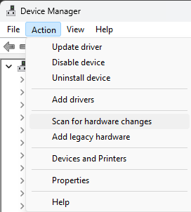
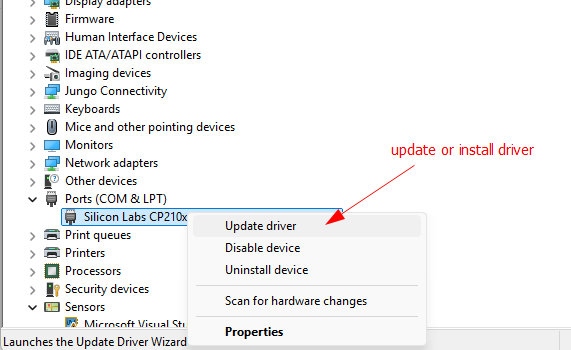
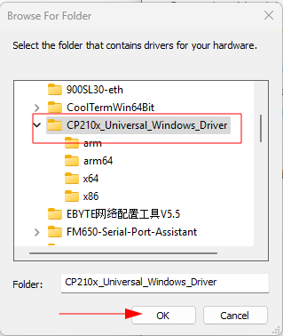
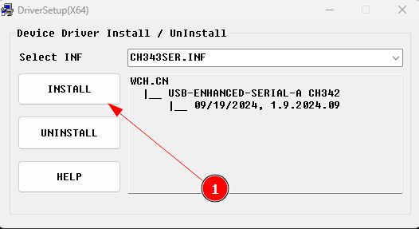
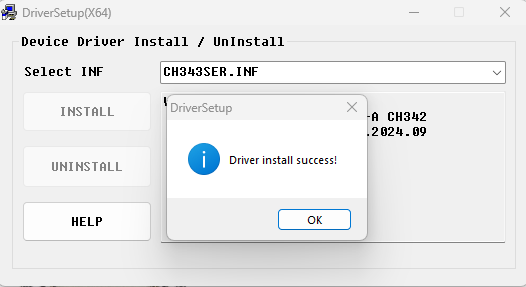
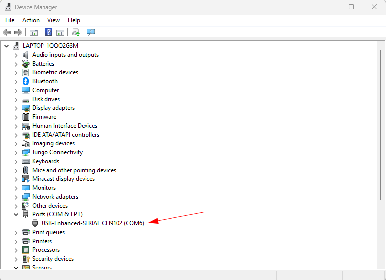

# Install Driver

Board ESP32 hadir dalam beberapa varian chip USB-to-serial, seperti CH340, CP2102, dan CH9102. Sebelum menggunakannya, pastikan untuk mengunduh dan menginstal driver yang sesuai dengan chip serial pada board Anda. Untuk menghindari masalah koneksi, periksa terlebih dahulu jenis chip yang digunakan agar driver yang diinstal benar. Jika salah memilih, board ESP32 mungkin tidak akan terdeteksi di komputer Anda.

#### CH340

Berikut adalah langkah-langkah untuk melakukan instalasi driver tersebut :

1. Download File Driver CH340/CH341di:

   - http://www.wch-ic.com/downloads/CH341SER_ZIP.html
   -  https://www.wch-ic.com/downloads/ch341ser_exe.html 
   
2. BIla memilh paket dalam bentuk zip maka terlebih dahulu lakukan extract file

4. Kemudian Klik INSTALL seperti tampak pada gambar dibawah ini.

 

5. Driver CH340 atau CH341 untuk Arduino sudah Ter-Install dan siap digunakan.
6. Silahkan digunakan untuk Upload Program dari Arduino IDE ke Board Arduino yang anda miliki.

---

#### CP2102

1. Download dan extract driver  yang ada di https://www.silabs.com/documents/public/software/CP210x_Universal_Windows_Driver.zip
2. Hasil extract akan seperti ini

3. di Windows Jalankan Device Manager
4. Hubungkan ESP32 ke komputer lewat kabel usb
5. bila tida terdeteks lakukan scan hardware

6. Jika terdeteksi Hasilnya akan seperti ini 
7. install driver atau update

8. Pada port bila sudah muncul COM berarti sudah terinstall proses sebelum, tetapi jika mestinya ada pilihan install, jika  pingin update driver bisa diklik update driver, bila sudah klik Ok

---

#### CH9102

1. Download driver serial di  cek di https://www.wch-ic.com/products/CH9102.html. pastikan memilih yang executable biar gampang

2. jalankan  executable file.  akan nampak seperti ini. pilih install

3. Bila sukses akan  ditampilkan info sebagai berikut

4. lepas  tancapkan lagi perangkat board esp32 anda, hasilnya bisa dicek akan seperti gambar berikut ini:

