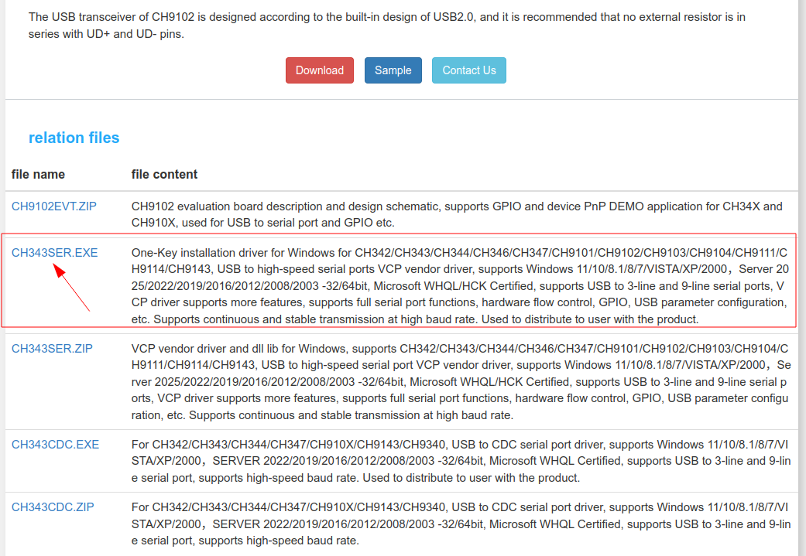

# Tutorial  ESP32 DevkitC-V4


| Perangkat | Pin/Alamat | Keterangan                |
| --------- | ---------- | ------------------------- |
| WS2812B   | GPIO16    | LED RGB addressable       |


[TOC]

## Install Driver

Board ESP32 mempunyai beberapa Varian Chip serial yaitu Board dengah chip serial CH340, CP2102, CH9102 dan beberapa variannya. Yang harus anda lakukakan adalah download driver serial terlebih dahulu dan menginstallnya di komputer anda. pastikan anda mendownload driver yang benar dengan cara mengenal chip serial dari board yang anda beli. bila salah download driver tentunya boar tersebut tidak akan dikenali dikomputer. 

#### CH340

Berikut adalah langkah-langkah untuk melakukan instalasi driver tersebut :

1. Download File Driver CH340/CH341di:

   - http://www.wch-ic.com/downloads/CH341SER_ZIP.html
   -  https://www.wch-ic.com/downloads/ch341ser_exe.html 
   
2. BIla memilh paket dalam bentuk zip maka terlebih dahulu lakukan extract file

4. Kemudian Klik INSTALL seperti tampak pada gambar dibawah ini.

 

5. Driver CH340 atau CH341 untuk Arduino sudah Ter-Install dan siap digunakan.

6. Silahkan digunakan untuk Upload Program dari Arduino IDE ke Board Arduino yang anda miliki.

#### CP2102

- https://www.silabs.com/documents/public/software/CP210x_Universal_Windows_Driver.zip


#### CH9102

Download driver serial di  cek di https://www.wch-ic.com/products/CH9102.html. pastikan memilih yang executable biar gampang




## Install Board

1. Pastikan Install Driver USB Serial terlebih dahulu
1. Masuk ke preferences


2. Klik Additional Board Manager


3. Tambahkan board esp32 kalimat berikut https://raw.githubusercontent.com/espressif/arduino-esp32/gh-pages/package_esp32_index.json


4. Pilih Tools -> Board -> Board Manager


5. Search ESP32 kemudian klik install


6. Pilih Tools -> Board -> ESP32 -> esp32 dev Module


7. Langkah berikutnya adalah memastikan Arduino mengetahui Kapasitas Flash yang tersedia. ini dilakukan dengan cara mengatur konfigurasi "Flash Size".  Pastikan  Flash anda menggunakan konfigurasi 4MB seperti pada gambar berikut


8. Pastikan upload speed 921600 
8. Pastikan serial port telah sesuai, untuk mengetahui nama port serial , pada OS windows bisa menggunakan device manager


## Contoh Kode Program

Buat file baru atau buka contoh program di **File -> Examples -> Basics -> BareMinimum**, kemudian yang harus anda lakukan adalah:

1. Gantikan kode yang ada dengan kode berikut:

```c++
const int BUTTON_PIN = 0;   // GPIO0 (Tombol BOOT)

unsigned long lastPressTime = 0;
const int pressDelay = 300;  // Minimal jeda antar input

void setup() {
  Serial.begin(115200);
  pinMode(BUTTON_PIN, INPUT_PULLUP);  // Aktifkan pull-up internal
  Serial.println("System Ready!");
}

void loop() {
  // Baca langsung tanpa debounce kompleks
  if(digitalRead(BUTTON_PIN) == LOW) {
    // Cek jeda waktu sejak penekanan terakhir
    if(millis() - lastPressTime > pressDelay) {
       Serial.println("Tombol BOOT ditekan!");
      lastPressTime = millis();      // Update waktu terakhir
    }
  } else {
  }
}
```

## Upload program

Bila tampilan seperti ini maka anda harus mengkonfigurasi ESP32 anda agar bisa melakukan download

```
- ---esptool.py v3.0-dev
- ---Serial port COM…
- ---Connecting........_____....._____.....__
```

Langkah yang harus dilakukan

- Pastikan ESP32 DevKitC-V4 terhubung ke komputer via USB
- Tekan dan tahan tombol Boot/0  
- Klik(tekan dan lepas) tombol reset/EN sambil tetap tekan tombol Boot .
- Lepas tombol boot
- Klik tombol upload pada Arduino IDE, bila sukses akan menampilkan info

```cpp
- ---Compressed 261792 bytes to 122378...
- ---Writing at 0x00010000... (12 %)
- ---Writing at 0x00014000... (25 %)
- ---Writing at 0x00018000... (37 %)
```

- Setelah selesai Wajib klik tombol **reset** sekali lagi untuk berpindah dari mode download menjadi mode run

> [!NOTE]  
> INGAT YA WAJIB Di Klik Tombol RESET setelah proses upload selesai, tanpa itu program yang baru diupload tidak akan dijalankan

## Uji Program Dengan serial monitor

- Buka Serial Monitor di Arduino IDE (Ctrl+Shift+M)

- Set baud rate ke **115200** (sesuai kode)

- Pastikan line ending diatur ke **Newline**

- Tekan **Tombol BOOT** (tombol sebelah USB port)

- Amati output di Serial Monitor:

- harusnya menampilkan data berikut setiap kali tombol boot ditekan

```
System Ready!
Tombol BOOT ditekan!
Tombol BOOT ditekan!  
```

## Pemecahan Masalah

### A. Port Com  tidak dapat dikenali di Arduino

Bila port COM di windows tidak dikenali pastikan install driver terlebih dahulu ada  beberapa kemungkinan yaitu permasalaha di chip, permasalah di usb serial, permasalahan di kabe dan permasalahan di komputer. 

### 1. Belum install  driver USB

Permasalahan yang umum adalah berlum install driver usb serial. Pastikan anda menginstall USB driver yang sesuai

### 2. Permasalahan kabel USB
Bila masih belum dikenali kemungkinan Kabel USB bukan merupakan kabel data melainkan kabel power saja. Jadi pastikan menggunakan kabel data yang berkualitas yang pendek (maksimal 1m). bila tidak dikenali juga coba di pindah port usb lainnya di komputer tersebut atau menggunakan komputer lainnya.  

### 3. Belum masuk Mode Bootloader

Belum masuk mode bootloader juga menyebebkan komputer tidak mengenali device ESP32. Untuk mengatasi ini caranya cukup simple yaitu dengan menekan tombol tertentu yang ada di ESP32 sehingga bisa masuk mode bootloader. untuk masuk ke mode bootloader  caranya sebagai berikut:

- Tekan dan tahan tombol Boot/0  
- Klik(tekan dan lepas) tombol reset/EN sambil tetap tekan tombol Boot .
- Lepas tombol boot
- Setelah selesai Wajib klik tombol **reset** sekali lagi untuk berpindah dari mode download menjadi mode run

### 4. Bootloop

Q:Mengapa diserial monitor muncul pesan seperti ini terus menerus seolah-olah sistem reset beruang kali.

```
E (158) esp_core_dump_flash: Core dump flash config is corrupted! CRC=0x7bd5c66f instead of 0x0
E (166) esp_core_dump_elf: Elf write init failed!
E (170) esp_core_dump_common: Core dump write failed with error=-1
Rebooting...
ets Jul 29 2019 12:21:46

rst:0xc (SW_CPU_RESET),boot:0x13 (SPI_FAST_FLASH_BOOT)
configsip: 0, SPIWP:0xee
clk_drv:0x00,q_drv:0x00,d_drv:0x00,cs0_drv:0x00,hd_drv:0x00,wp_drv:0x00
mode:DIO, clock div:1
load:0x3fff0030,len:4916
load:0x40078000,len:16436
load:0x40080400,len:4
ho 8 tail 4 room 4
load:0x40080404,len:3524
entry 0x400805b8
E (130) spi_flash: Detected size(4096k) smaller than the size in the binary image header(16384k). Probe failed.

assert failed: __esp_system_init_fn_init_flash startup_funcs.c:95 (flash_ret == ESP_OK)


Backtrace: 0x400822f9:0x3ffe3a60 0x40088219:0x3ffe3a80 0x4008dda6:0x3ffe3aa0 0x400d65b0:0x3ffe3bd0 0x400d77cf:0x3ffe3bf0 0x400d7801:0x3ffe3c10 0x40082696:0x3ffe3c40 0x40079772:0x3ffe3c90 |<-CORRUPTED
```

A: Bila muncul pesan terus menerus, itu adalah bootloop dimana program tidak di jalankan karena komputer reset terus menerus. Bootloop bisa terjadi karena salah konfigurasi flash. sebagai contoh ukuran flash dari IC adalah 4MB tetapi memilh board yang 8MB. jadi pastikan konfigurasi ukuran flash telah sesuai

### B. Program tidak dapat berjalan setelah diunggah

Setelah upload berhasil, Anda perlu menekan tombol Reset sebelum dapat dijalankan.

